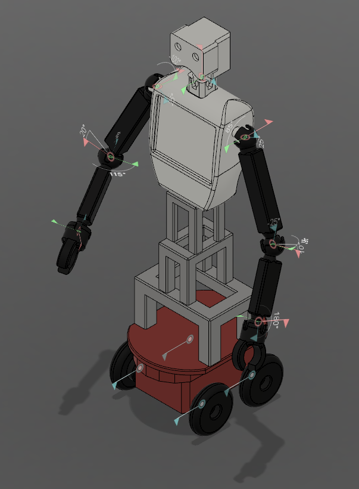
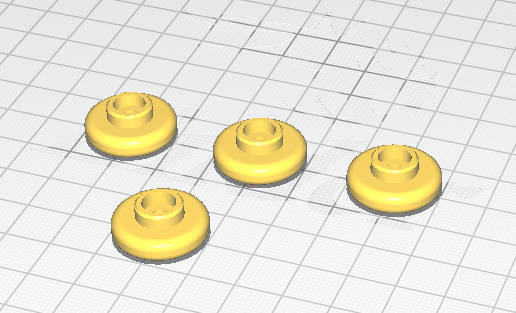
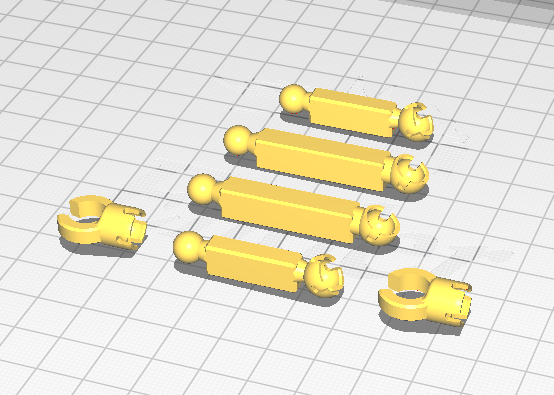
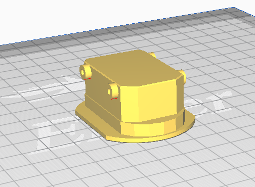
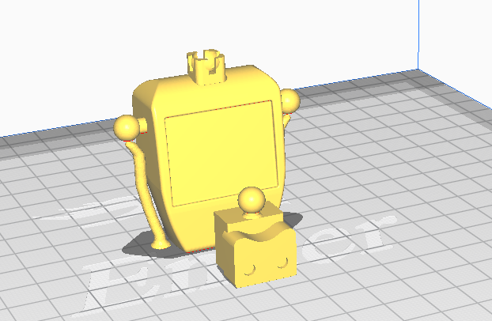
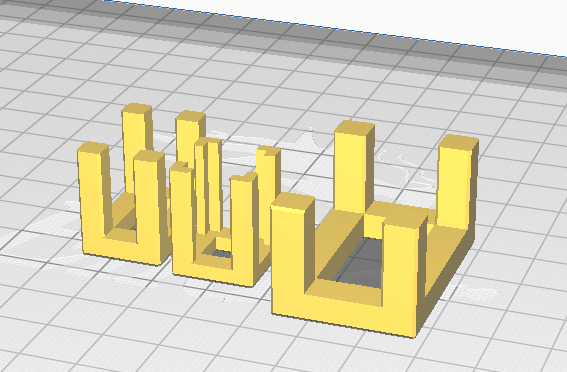

# Figura de acción Bender UChile 3D

[![CC BY 4.0][cc-by-shield]][cc-by]

Figura de acción del Robot [Bender UChile](http://robotica-uchile.amtc.cl/bender-index.html) para imprimir en 3D.

Esta figurita de nuestro querido Bender la modelé el año 2015 como recompensa para la campaña de recaudación de fondos elaborada por el equipo Uchile Homebreakers para viajar a la robocup en China. Ahora, luego de 5 años de su creación, lo libero para que sea libre y pueda vivir en los escritorios de todos quienes quieran imprimirlo.

## Articulado!

El modelo tiene 3 articulaciones esféricas en cada brazo (hombro, codo y muñeca), una articulación esférica en el cuello, y las cuatro ruedas pueden rodar por separado utilizando un perno M3 como eje.

Armado mide aproximadamente 155mm con la cabeza estirada y con los brazos abiertos mide aprox 200mm de ancho (si, tiene los brazos largos tal como el Bender de la época)

## Partes

Las piezas en .STL las encuentras en la carpeta [cad/stl/partes](cad/stl/partes)

Para armar a Bender debes imprimir lo siguientes archivos en las cantidades indicadas y colores *sugeridos*

| **nombre parte** | **cantidad** | **color** |
|  --------------  |   -------    |   ------  |
|   rueda.stl      |  4           |   negro   |
|   base.stl       |  1           |   rojo    |
|   estructura1.stl|  1           |   gris    |
|   estructura2.stl|  1           |   gris    |
|   estructura3.stl|  1           |   gris    |
|   torso.stl      |  1           |   blanco  |
|   brazo.stl      |  2           |   negro   |
|   antebrazo.stl  |  2           |   negro   |
|   gripper.stl    |  2           |   negro   |
|   cabeza.stl     |  1           |   blanco  |

El archivo del torso se entrega además en una versión con los soportes integrados para llegar e imprimir (torso_soportes.stl).

También se agregan archivos listos para imprimir por color:

| **nombre archivo** | **contenido** | **color** |
|  --------------  |   -------    |   ------  |
|   brazos.stl      |  2x antebrazo, brazo y gripper  |   negro   |
|   estructura.stl  |  1x estructura1, estructura2 y estructura3 |   gris    |
|   torso_cabeza.stl |  1x torso con soportes y cabeza  |   blanco  |
|   ruedas.stl      |   4x rueda            |    negro  |

### Orientación recomendada para impresión

## Ensamblaje

## Modificación del modelo

Si quieres hacer alguna modificación al modelo también se encuentran en la carpeta [cad/f3d]() los archivos editables en formato f3d (fusion360) y en la carpeta [cad/stp]() los archivos en formato STEP.

## Licencia

Este modelo está publicado bajo la licencia [CC-BY-4.0][cc-by]

[![CC BY SA 4.0][cc-by-image]][cc-by]

[cc-by]: https://creativecommons.org/licenses/by/4.0/
[cc-by-image]: https://i.creativecommons.org/l/by/4.0/88x31.png
[cc-by-shield]: https://img.shields.io/badge/License-CC%20BY%204.0-lightgrey.svg
